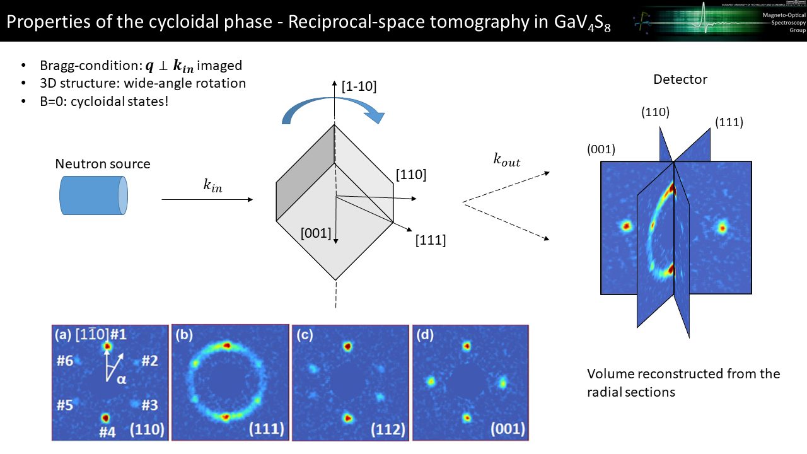

# Reciprocal-space tomography for Small-angle Neutron Scattering data

## Description
This code performs the reconstruction of the 3d scattering image from the 2d slices measured in a small-angle neutron scattering experiment upon the wide-angle rotation of the sample. See the image below:

## Files
The live Matlab scripts in the root directory are for demonstration purposes only, they will not run due to the references to data inside the actual working folders.

Recover_volumetric_data_1deg.mlx: This code performs the 3d image reconstruction from the 2D slices and saves the 3d data to .m files. Running time is typically ~5-10 mins due to the 3d interpolation steps involved.

GMS_Reciprocal_Space_Tomography.mlx: This code displays the reconstructed image, opened from the .m files exported by the first code. Additional data processing steps are performed to enhance signal-to-noise ratio. In case of the GaMo4S8 SANS data, the image quality is improved by enforcing all the symmetry operations of the Td symmetry group of the crystal on the 3d scattering image. The symmetrized image is loaded from another .m file. 

The reconstructed images look like this:

